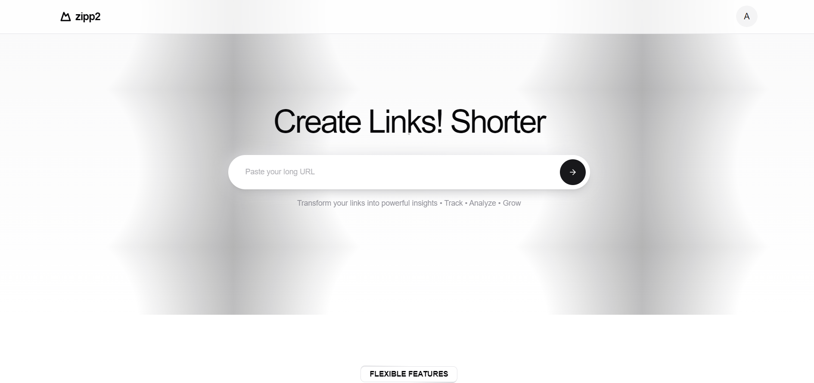
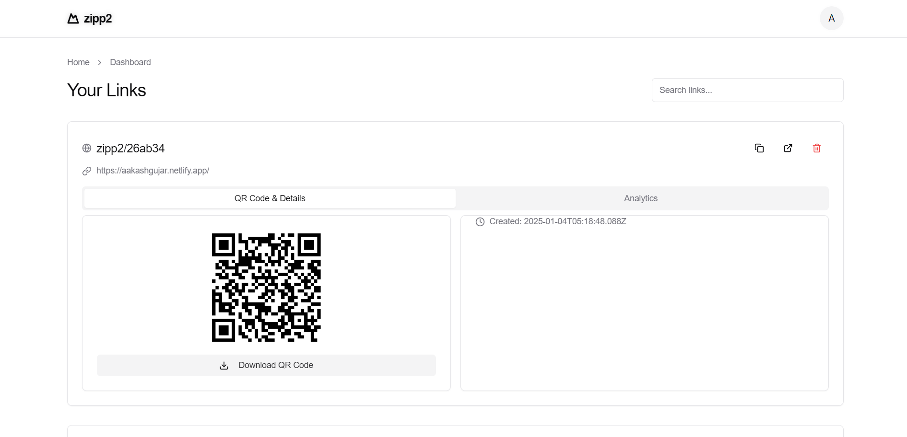

# zipp2

#### [🔗Link](https://zipp2.vercel.app/)

#### Its still Work in progress

  
Dashboard:  

A full-stack **URL Shortener** application built with the **PERN stack** (PostgreSQL, Express.js, React.js, Node.js) and **TypeScript**.  
The app allows users to shorten long URLs, track usage analytics, and manage their links effectively.

## Features

- **URL Shortening**: Generate shorter, shareable links.
- **Analytics**: View click stats for each shortened URL.
- **Authentication**: Secure login/signup with user data management.
- **Responsive UI**: Modern and accessible design.

## Tech Stack

- **React** with **Vite**
- **Redux Toolkit**
- **TailwindCSS**
- **Node.js**, **Express.js**
- **PostgreSQL** (using **NeonDB**)

## (Work in Progress)

This project is under development. **Future improvements** include:

- **Custom URL Generation**: Allow users to create personalized short URLs.
- **Backend-independent Links**: Ensure links continue to work even if the backend is down.
- **Custom Domains**: Enable users to use their own domain for shortened URLs.
- **Scalability**: Currently limited due to deployment on Render with API call restrictions (For now implemented a CRON JOB to prevent the server from going down :P)
